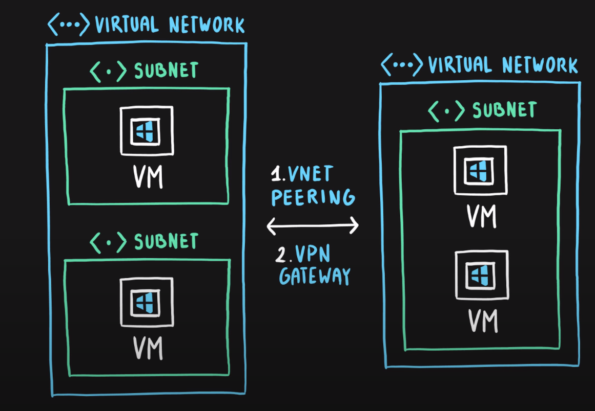
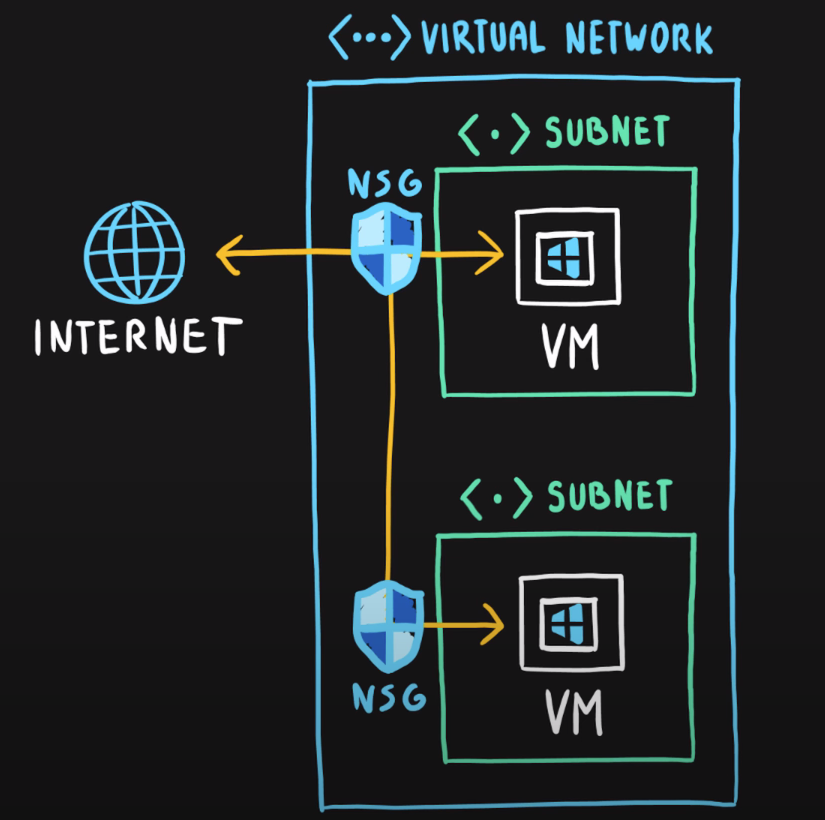
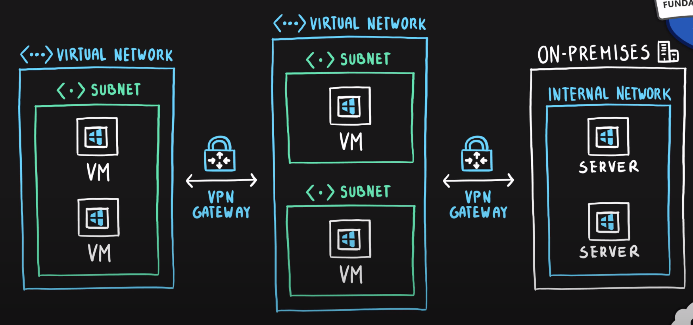
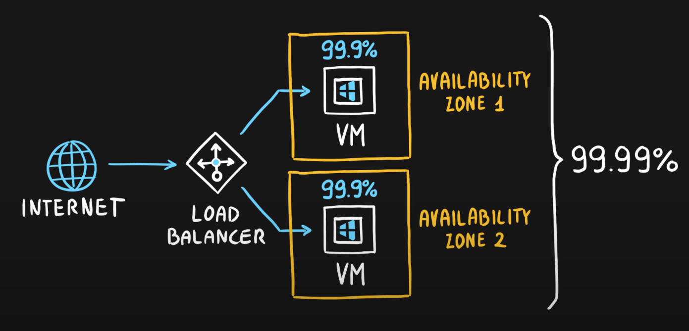
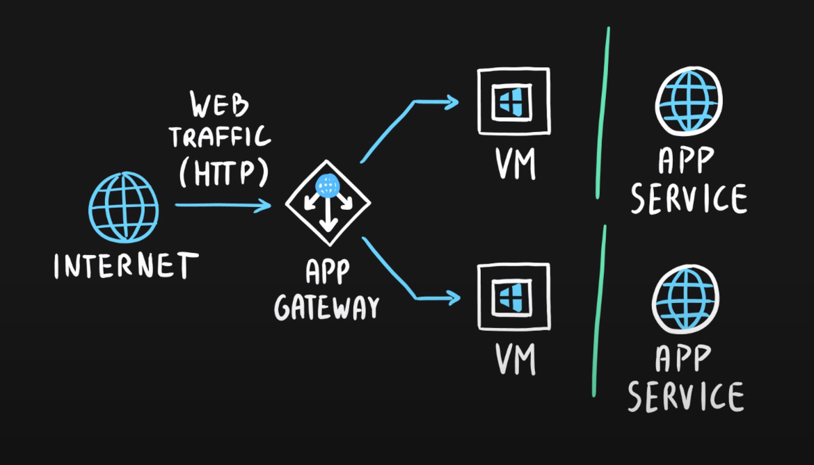
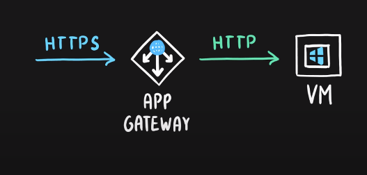
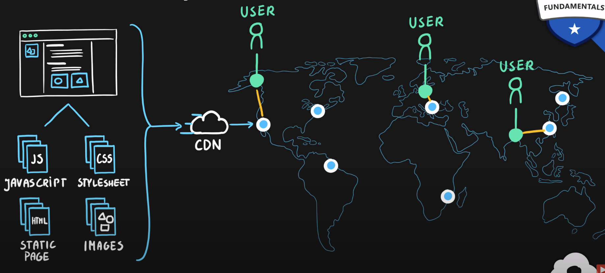

# Networking Services Basic

Networking services are the services that are used to connect computers and devices together. They are the services that allow us to communicate with each other. It can be used to connect cloud and on-premise resources, protect and monitor the network, and help with application delivery.

## Azure Virtual Network

Azure Virtual Network is a service that allows us to create private networks in the cloud. It is the fundamental building block for private networks in Azure. It allows us to create subnets, route tables, private IP address ranges, and network gateways. 

Virtual Machines are the physical servers that we can create in the cloud. It needs to be connected to a network to communicate with other resources. We can create a virtual network and connect virtual machines to it.

Virtual networks can be segmented into subnets. Subnets are used to segment the network into smaller networks. It can be used to isolate resources and control traffic flow.

**Purpose of Subnets**
- Isolate resources
- Control traffic flow
- Apply network security policies (Network Security Groups / Application Security Groups) in groups
- Manage IP address ranges

## Multiple Virtual Networks

Sometimes we need to connect multiple virtual networks together. As a virtual machine can only reside within a single region, for multiple region applications, we need to have multiple virtual networks and connect them together. We can connect virtual networks together using _virtual network peering_ or _virtual network gateways_.

Virtual network peering and virtual network gateways allow you to connect to both your on-premise network and other virtual networks in Azure over the public internet. 

## Load Balancer

Load balancer is a service that distributes traffic across multiple virtual machines. It is used to improve the availability and 
scalability of applications. You can have multiple virtual machines behind a load balancer. If one virtual machine fails, the load balancer will redirect traffic to the other virtual machines. You can also have multiple load balancers with multiple tiers of virtual networks to separate traffic between public and private networks.

**Purpose of Load Balancer**
- Improve availability
- Improve scalability
- Supports both inbound and outbound connections
- Can manage external and internal traffic

## Application Gateway

Application Gateway is a service that provides application delivery controller (ADC) as a service. It is used to manage traffic to web applications. It can act as a reverse proxy, load balancer, and web application firewall and allows us to manage traffic to web application. It can also redirect traffic to any public ip/address as well as to virtual machines.

**Purpose of Application Gateway**
- Manage traffic to web applications
- Provides SSL termination
- Provides URL-based routing
- Provides cookie-based session affinity
- Provides web application firewall
- Supports redirection

## Content Delivery Network (CDN)

Content Delivery Network is a service that delivers high-bandwidth content to users around the world. It is used to deliver static content such as images, videos, and other files. It is used to improve the performance of web applications. It stores cached content in edge locations around the world. When a user requests content, it will be delivered from the nearest edge location.

**Purpose of Content Delivery Network**
- Improve performance
- Reduce latency

_Credit: [Adam Marczak - Azure for Everyone](https://www.youtube.com/watch?v=5NMcM4zJPM4)_ 